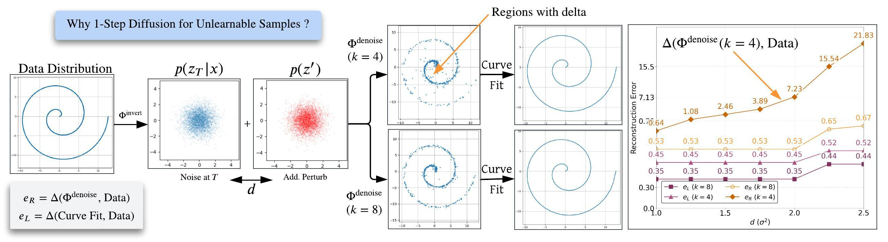
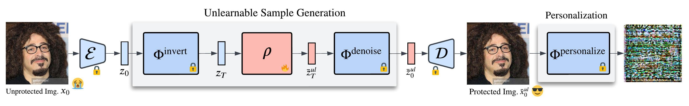

# [ACM MM 2025] Latent Diffusion Unlearning: Protecting against Unauthorized Personalization through Trajectory Shifted Perturbations

<p align="center">
  <strong>Naresh Kumar Devulapally</strong>¹ &middot;  
  <strong>Shruti Agarwal</strong>² &middot; 
  <strong>Tejas Gokhale</strong>³ &middot; 
  <strong>Vishnu Suresh Lokhande</strong>¹
</p>

<p align="center">
  ¹University at Buffalo, SUNY &bull; ²Adobe Research &bull; ³University of Maryland, Baltimore County
</p>

Text-to-image diffusion models have demonstrated remarkable effectiveness in rapid and high-fidelity personalization, even when provided with only a few user images. However, the effectiveness of personalization techniques has lead to concerns regarding data privacy, intellectual property protection, and unauthorized usage. To mitigate such unauthorized usage and model replication, the idea of generating "unlearnable" training samples utilizing image poisoning techniques has emerged. Existing methods for this have limited imperceptibility as they operate in the pixel space which results in images with noise and artifacts. In this work, we propose a novel model-based perturbation strategy that operates within the latent space of diffusion models. Our method alternates between denoising and inversion while modifying the starting point of the denoising trajectory: of diffusion models. This trajectory-shifted sampling ensures that the perturbed images maintain high visual fidelity to the original inputs while being resistant to inversion and personalization by downstream generative models. This approach integrates unlearnability into the framework of Latent Diffusion Models (LDMs), enabling a practical and imperceptible defense against unauthorized model adaptation. We validate our approach on four benchmark datasets to demonstrate robustness against state-of-the-art inversion attacks. Results demonstrate that our method achieves significant improvements in imperceptibility ($\sim 8 \% -10\%$ on perceptual metrics including PSNR, SSIM, and FID) and robustness ( $\sim 10\%$ on average across five adversarial settings), highlighting its effectiveness in safeguarding sensitive data.

## Installation

Our codebase directly builds on top of [Diffusers](https://github.com/huggingface/diffusers) library.

### PyTorch

With `pip`:

```bash
pip install --upgrade diffusers[torch]
```

We utilize Textual Inversion and DreamBooth as personalization models.

```bash
git clone https://github.com/huggingface/diffusers
cd diffusers
pip install .

cd examples/textual_inversion
pip install -r requirements.txt

accelerate config
accelerate config default
```

We utilize [shortcut diffusion model](https://arxiv.org/abs/2410.12557) for denoising to enable unlearnable perturbation propagation.



Our training pipeline is shown in the figure below:



# Acknowledgements

Our codebase is based on the following repos:

1. https://github.com/huggingface/diffusers/blob/main/examples/textual_inversion/README.md
2. https://github.com/kvfrans/shortcut-models
3. https://github.com/XavierXiao/Dreambooth-Stable-Diffusion
4. https://github.com/NVlabs/DiffPure
